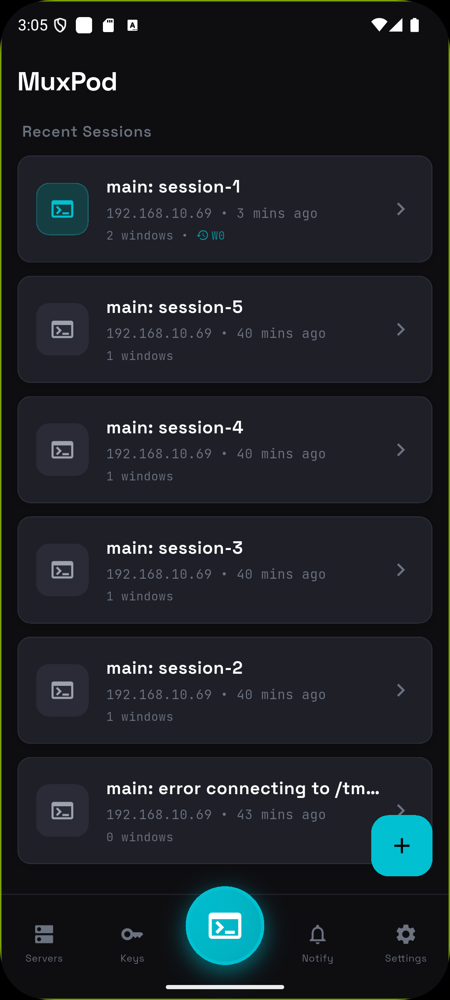
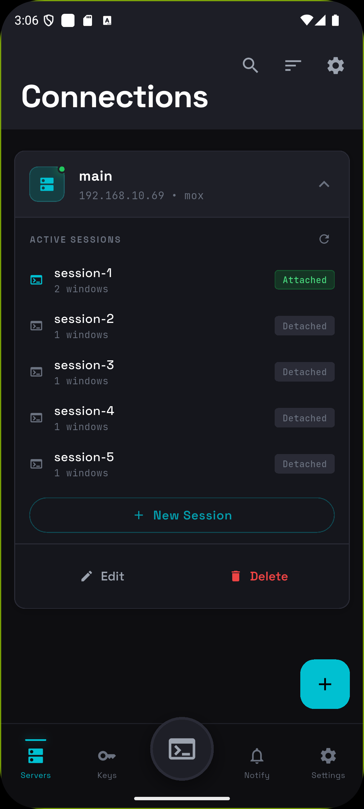
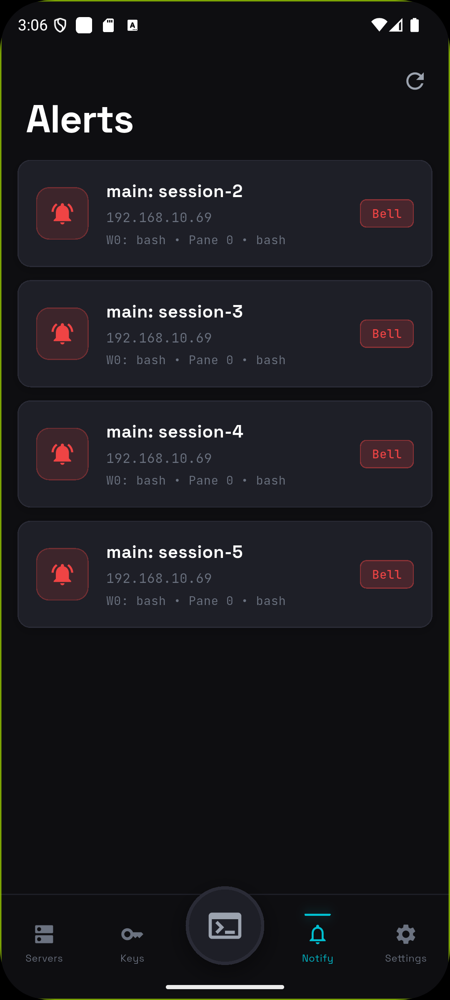
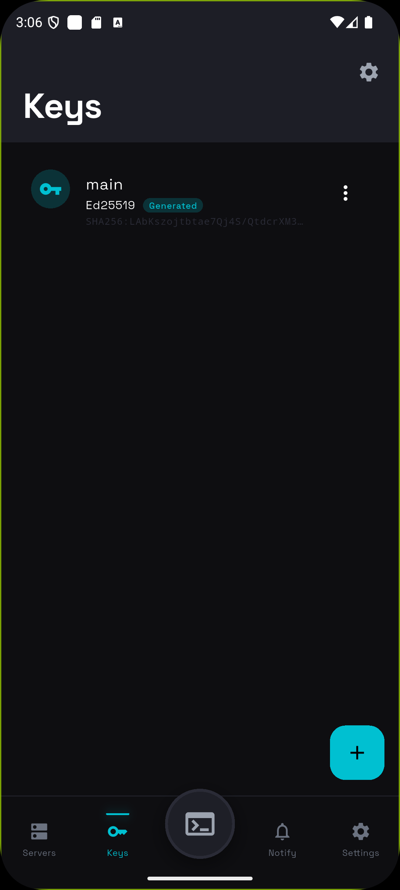
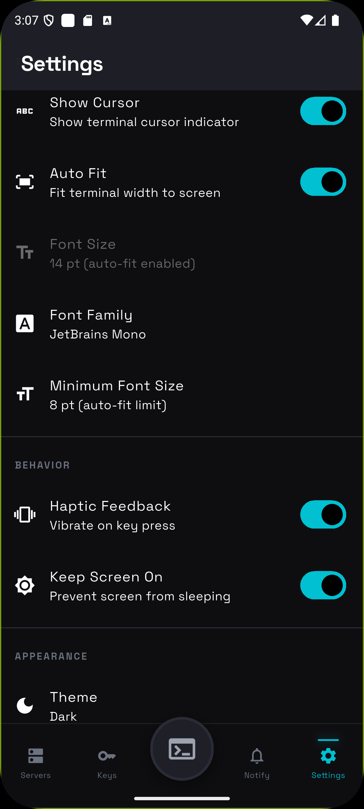
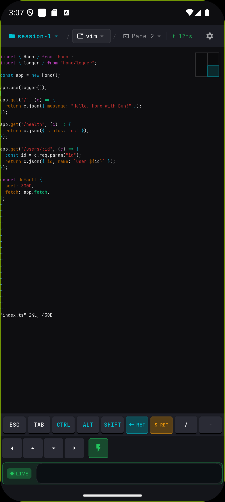
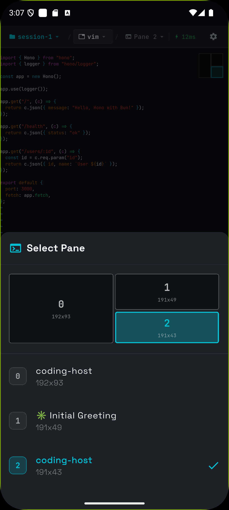

<p align="center">
  
</p>

<h1 align="center">MuxPod</h1>

<p align="center">
  <b>tmuxセッションを、ポケットに。</b><br>
  <sub>Android向けモバイルファーストtmuxクライアント — SSH接続、セッション操作、外出先でも生産的に。</sub>
</p>

<p align="center">
  <a href="https://github.com/moezakura/mux-pod/releases"></a>
  <a href="LICENSE"></a>
  
  
</p>

<p align="center">
  <a href="README.md">🇺🇸 English</a>
</p>

---

<div align="center">
  <video src="https://github.com/user-attachments/assets/c7405e41-41ed-43ac-afb0-35091a357117" width="280" autoplay loop muted playsinline></video>
</div>

---

## なぜ MuxPod？

長時間実行中のプロセスを確認したい、サービスを再起動したい、ログを覗きたい — でもPCから離れている。そんな経験ありませんか？

**MuxPodは、あなたのAndroidをtmuxリモコンに変えます。**

- 🚀 **サーバー設定ゼロ** — `sshd`が動いていればOK。エージェント不要、デーモン不要、インストール不要。
- 📱 **モバイルのために設計** — 無理やりスマホに押し込んだターミナルではない。タッチ操作を考え抜いたUI。
- 🔐 **デフォルトで安全** — SSH鍵はAndroid Keystoreに保存。認証情報はデバイスの外に出ない。

---

## アプリ構成

MuxPodは中央にDashboardを配置した5タブナビゲーションで、セッションへ素早くアクセスできます。

| Dashboard | Servers | Alerts | Keys | Settings |
|:---------:|:-------:|:------:|:----:|:--------:|
|  |  |  |  |  |

### 🏠 Dashboard

ホーム画面。最終アクセス日時順でセッション履歴を表示（「たった今」「5分前」など相対時間）。**ワンタップで再接続** — 前回のウィンドウとペインに即座に復帰。

### 📡 Servers

SSH接続を管理。**タップして展開**するとアクティブなtmuxセッション一覧をAttached/Detachedステータス付きで表示。新規セッション作成も既存セッションへの接続もここから。

### 🔔 Alerts

すべての接続にわたってtmuxウィンドウフラグをリアルタイム監視。

| フラグ | 色 | 意味 |
|--------|-----|------|
| Bell | 🔴 赤 | ウィンドウでベルが発生 |
| Activity | 🟠 オレンジ | ウィンドウの内容が変化 |
| Silence | ⚫ グレー | 一定時間無活動 |

**アラートをタップ**すると該当のウィンドウとペインに直接ジャンプ。アラートは自動的にクリアされます。

### 🔑 Keys

**Ed25519**（推奨）または **RSA**（2048/3072/4096ビット）鍵をデバイス上で生成。既存の鍵をインポートも可能。パスフレーズ保護対応でセキュアに保存。**ワンタップで公開鍵をコピー**。

### ⚙️ Settings

ターミナルの外観（フォント、カラー）、動作（ハプティックフィードバック、画面オン維持）、接続設定をカスタマイズ。

---

## ターミナル体験

ターミナル画面はMuxPodの真骨頂 — モバイルでのtmux操作のために設計されています。

### 🗂️ パンくずナビゲーション

ヘッダーの**セッション → ウィンドウ → ペイン**をタップして瞬時にコンテキスト切り替え。ペインセレクターでは分割ペインの**ビジュアルレイアウト**を正確な比率で表示。

| Terminal | Pane Selector |
|:--------:|:-------------:|
|  |  |

### 👆 タッチジェスチャー

| ジェスチャー | 動作 |
|-------------|------|
| **ホールド + スワイプ** | 矢印キー送信（↑↓←→）— vim/nanoなどのエディタに最適 |
| **ピンチ** | ズームイン/アウト（50%〜500%） |
| **ペインインジケーターをタップ** | ビジュアルレイアウト付きクイックペイン切り替え |

### ⌨️ 特殊キーバー

ターミナル必須キーの専用ボタン：

```
[ESC] [TAB] [CTRL] [ALT] [SHIFT] [ENTER] [S-RET] [/] [-]
[←] [↑] [↓] [→]  [⚡ DirectInput]  [Input...]
```

- **修飾キーはトグル式** — CTRLをタップ後、'c'を入力でCtrl-C
- **S-RET** — Claude Codeの確認用Shift+Enter
- **DirectInputモード** — ライブインジケーター付きリアルタイムキーストリーミング

### 📋 コピー/ペーストモード

**Scroll & Select Mode**をトグルでテキスト選択を有効化。選択中はターミナル更新がバッファリングされるのでコンテンツがジャンプしません。選択テキストはシステムクリップボードにコピー。

### ⚡ 接続の堅牢性

- **自動再接続** — 指数バックオフで最大5回リトライ
- **入力キューイング** — 切断中も入力可能、再接続時に自動送信
- **レイテンシインジケーター** — リアルタイムping表示（緑 < 100ms、赤 > 500ms）
- **適応型ポーリング** — アクティビティに応じて50ms〜500msで動的調整、バッテリー最適化

---

## クイックスタート

### インストール

[**Releases**](https://github.com/moezakura/mux-pod/releases) から最新のAPKをダウンロード。

### またはソースからビルド

```bash
git clone https://github.com/moezakura/mux-pod.git
cd mux-pod
flutter pub get
flutter build apk --release
```

### 接続

1. **サーバーを追加** — Serversタブで+をタップ、ホスト/ポート/ユーザー名を入力
2. **認証** — パスワードまたはSSH鍵を選択（Keysタブで生成可能）
3. **ナビゲート** — サーバーを展開 → セッション選択 → ウィンドウをタップ → ペインを選択
4. **操作** — タッチジェスチャー、特殊キーバー、またはDirectInputモードを使用

---

## 必要要件

| コンポーネント | 要件 |
|----------------|------|
| **デバイス** | Android 8.0以上（API 26） |
| **サーバー** | 任意のSSHサーバー（OpenSSH、Dropbearなど） |
| **tmux** | 任意のバージョン（2.9以上で動作確認） |

---

## 技術スタック

| | |
|---|---|
| **フレームワーク** | Flutter 3.24+ / Dart 3.x |
| **SSH** | [dartssh2](https://pub.dev/packages/dartssh2) |
| **ターミナル** | [xterm](https://pub.dev/packages/xterm) |
| **状態管理** | [flutter_riverpod](https://pub.dev/packages/flutter_riverpod) |
| **セキュリティ** | [flutter_secure_storage](https://pub.dev/packages/flutter_secure_storage) |

<details>
<summary>全依存関係</summary>

- `cryptography`, `pointycastle` — 鍵生成
- `flutter_local_notifications` — アラートシステム
- `flutter_foreground_task` — バックグラウンド接続
- `wakelock_plus` — 画面オン維持
- `shared_preferences` — 設定保存

</details>

---

## 開発

```bash
# デバッグモードで実行
flutter run

# 静的解析
flutter analyze

# テスト実行
flutter test
```

アーキテクチャとコーディング規約は [docs/](docs/) を参照。

---

## コントリビューション

コントリビューション歓迎！

- 🐛 バグ報告
- 💡 機能提案
- 🔧 PRの送信

---

## ライセンス

[Apache License 2.0](LICENSE) © 2025 mox

---

<p align="center">
  <sub>☕ と Flutter で作られました</sub>
</p>
