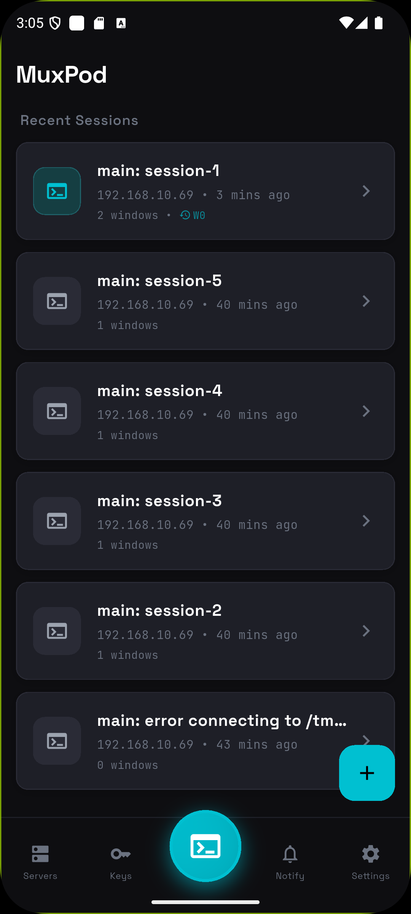
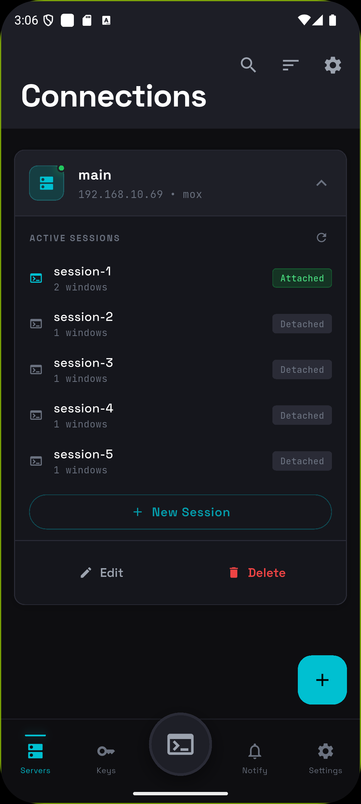
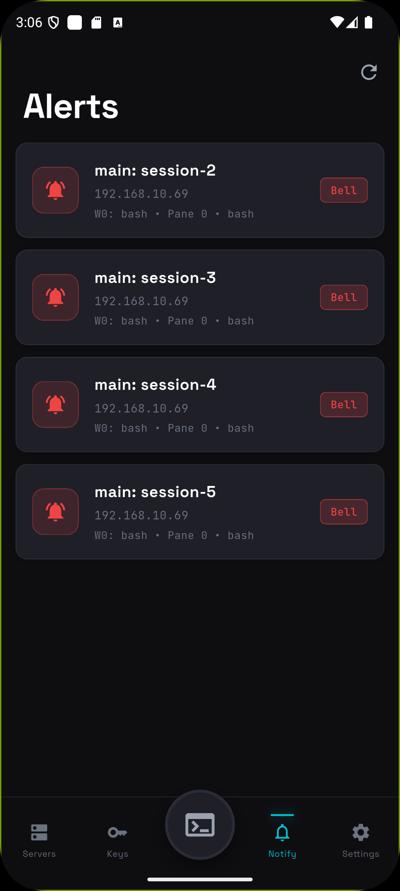
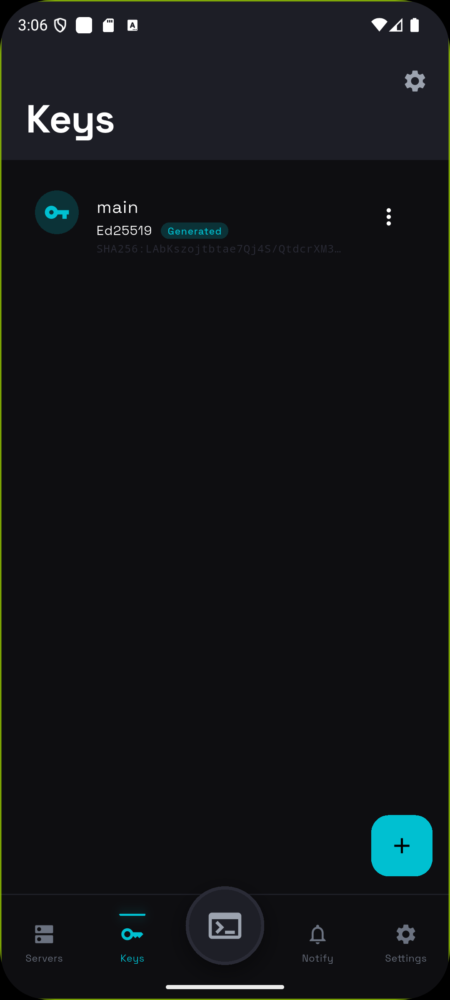
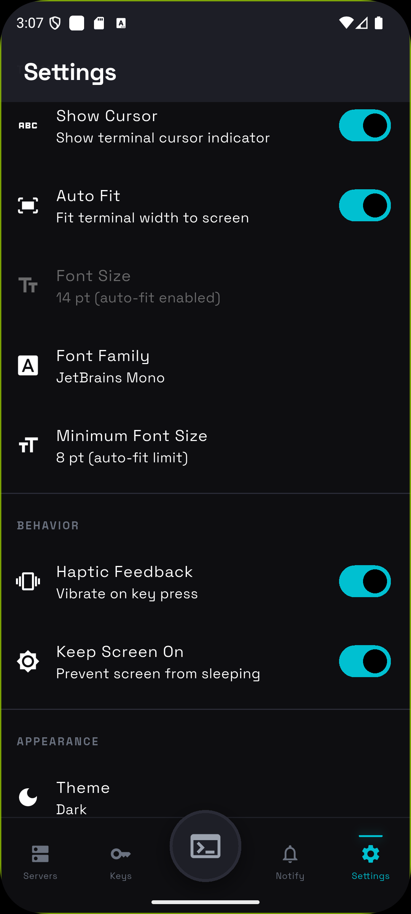
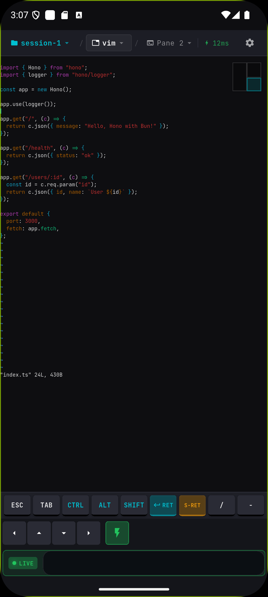
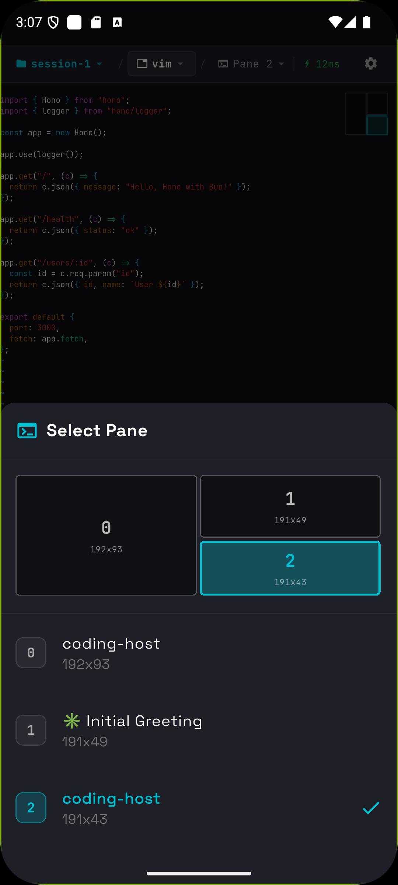

<p align="center">
  
</p>

<h1 align="center">MuxPod</h1>

<p align="center">
  <b>Your tmux sessions, in your pocket.</b><br>
  <sub>A mobile-first tmux client for Android — SSH in, navigate sessions, and stay productive on the go.</sub>
</p>

<p align="center">
  <a href="https://github.com/moezakura/mux-pod/releases"></a>
  <a href="LICENSE"></a>
  
  
</p>

<p align="center">
  <a href="README.ja.md">🇯🇵 日本語</a>
</p>

---

<div align="center">
  <video src="https://github.com/user-attachments/assets/c7405e41-41ed-43ac-afb0-35091a357117" width="280" autoplay loop muted playsinline></video>
</div>

---

## Why MuxPod?

Ever needed to check on a long-running process, restart a service, or peek at logs while away from your desk?

**MuxPod turns your Android phone into a tmux remote control.**

- 🚀 **Zero server setup** — Works with any server running `sshd`. No agents, no daemons, nothing to install.
- 📱 **Built for mobile** — Not a terminal crammed into a phone. A thoughtful UI designed for touch.
- 🔐 **Secure by default** — SSH keys stored in Android Keystore. Your credentials never leave the device.

---

## App Structure

MuxPod uses a 5-tab navigation with Dashboard at the center for quick session access.

| Dashboard | Servers | Alerts | Keys | Settings |
|:---------:|:-------:|:------:|:----:|:--------:|
|  |  |  |  |  |

### 🏠 Dashboard

Your home screen. Recent sessions sorted by last access time with relative timestamps ("Just now", "5 min ago"). **One tap to reconnect** — instantly returns to your last window and pane.

### 📡 Servers

Manage SSH connections. **Tap to expand** a server card and see active tmux sessions with attach/detach status. Create new sessions or jump into existing ones.

### 🔔 Alerts

Monitor tmux window flags across all connections in real-time.

| Flag | Color | Meaning |
|------|-------|---------|
| Bell | 🔴 Red | Window triggered a bell |
| Activity | 🟠 Orange | Content changed in window |
| Silence | ⚫ Gray | No activity for a while |

**Tap any alert** to jump directly to that window and pane. The alert is automatically cleared.

### 🔑 Keys

Generate **Ed25519** (recommended) or **RSA** (2048/3072/4096-bit) keys on-device. Import existing keys. All stored securely with optional passphrase protection. **One-tap copy** public key to clipboard.

### ⚙️ Settings

Customize terminal appearance (fonts, colors), behavior (haptic feedback, keep screen on), and connection settings.

---

## Terminal Experience

The terminal screen is where MuxPod shines — purpose-built for mobile tmux interaction.

### 🗂️ Breadcrumb Navigation

Tap **Session → Window → Pane** in the header to switch contexts instantly. The pane selector shows a **visual layout** of your split panes with accurate proportions.

| Terminal | Pane Selector |
|:--------:|:-------------:|
|  |  |

### 👆 Touch Gestures

| Gesture | Action |
|---------|--------|
| **Hold + Swipe** | Send arrow keys (↑↓←→) — perfect for editors like vim/nano |
| **Pinch** | Zoom in/out (50%–500%) |
| **Tap pane indicator** | Quick pane switcher with visual layout |

### ⌨️ Special Keys Bar

Dedicated buttons for terminal essentials:

```
[ESC] [TAB] [CTRL] [ALT] [SHIFT] [ENTER] [S-RET] [/] [-]
[←] [↑] [↓] [→]  [⚡ DirectInput]  [Input...]
```

- **Modifier keys toggle** — Tap CTRL, then type 'c' for Ctrl-C
- **S-RET** — Shift+Enter for Claude Code confirmation
- **DirectInput mode** — Real-time keystroke streaming with live indicator

### 📋 Copy/Paste Mode

Toggle **Scroll & Select Mode** to enable text selection. Terminal updates are buffered while you select, so content won't jump. Selected text copies to system clipboard.

### ⚡ Connection Resilience

- **Auto-reconnect** — Up to 5 retries with exponential backoff
- **Input queuing** — Type while disconnected; commands send automatically on reconnect
- **Latency indicator** — Real-time ping display (green < 100ms, red > 500ms)
- **Adaptive polling** — 50ms–500ms based on activity for battery optimization

### Deep Linking

Open MuxPod directly to a specific server, session, window, or pane from external apps using the `muxpod://` URL scheme.

**URL format:**

```
muxpod://connect?server=<id>&session=<name>&window=<name>&pane=<index>
```

| Parameter | Required | Description |
|-----------|----------|-------------|
| `server` | Yes | Matches the connection's **Deep Link ID** first, then falls back to **connection name** (case-insensitive) |
| `session` | No | tmux session name to attach to. If omitted, uses the first available session |
| `window` | No | tmux window name to switch to |
| `pane` | No | Pane index within the window (0-based) |

**Setup:**

1. Open a connection in **Servers** > **Edit**
2. Set a **Deep Link ID** (e.g., `macbook-pro`) — this is a stable identifier you use in URLs
3. Use the same ID in your external scripts/notifications

**Example — Claude Code finish notification with deep link:**

```
muxpod://connect?server=macbook-pro&session=dev&window=claude&pane=0
```

This will: find the server by ID `macbook-pro` → SSH connect → attach to session `dev` → switch to window `claude` → focus pane `0`.

Works on both **Android** (intent filter) and **iOS** (URL type). Supports cold start (app not running) and hot links (app in background).

**Use with [claude-telegram-notify](https://github.com/launch52-ai/claude-telegram-notify)** to get Telegram notifications when Claude Code finishes or needs input, with tappable deep links that open MuxPod directly to the right terminal.

---

## Quick Start

### Install

Download the latest APK from [**Releases**](https://github.com/moezakura/mux-pod/releases).

### Or build from source

```bash
git clone https://github.com/moezakura/mux-pod.git
cd mux-pod
flutter pub get
flutter build apk --release
```

### Connect

1. **Add a server** — Tap + on Servers tab, enter host/port/username
2. **Authenticate** — Choose password or SSH key (generate in Keys tab)
3. **Navigate** — Expand server → select session → tap window → choose pane
4. **Interact** — Use touch gestures, special keys bar, or DirectInput mode

---

## Requirements

| Component | Requirement |
|-----------|-------------|
| **Device** | Android 8.0+ (API 26) |
| **Server** | Any SSH server (OpenSSH, Dropbear, etc.) |
| **tmux** | Any version (tested with 2.9+) |

---

## Tech Stack

| | |
|---|---|
| **Framework** | Flutter 3.24+ / Dart 3.x |
| **SSH** | [dartssh2](https://pub.dev/packages/dartssh2) |
| **Terminal** | [xterm](https://pub.dev/packages/xterm) |
| **State** | [flutter_riverpod](https://pub.dev/packages/flutter_riverpod) |
| **Security** | [flutter_secure_storage](https://pub.dev/packages/flutter_secure_storage) |

<details>
<summary>Full dependency list</summary>

- `cryptography`, `pointycastle` — Key generation
- `flutter_local_notifications` — Alert system
- `flutter_foreground_task` — Background connection
- `wakelock_plus` — Keep screen on
- `shared_preferences` — Settings storage

</details>

---

## Development

```bash
# Run in debug mode
flutter run

# Static analysis
flutter analyze

# Run tests
flutter test
```

See [docs/](docs/) for architecture details and coding conventions.

---

## Contributing

Contributions welcome! Feel free to:

- 🐛 Report bugs
- 💡 Suggest features
- 🔧 Submit PRs

---

## License

[Apache License 2.0](LICENSE) © 2025 mox

---

<p align="center">
  <sub>Built with ☕ and Flutter</sub>
</p>
